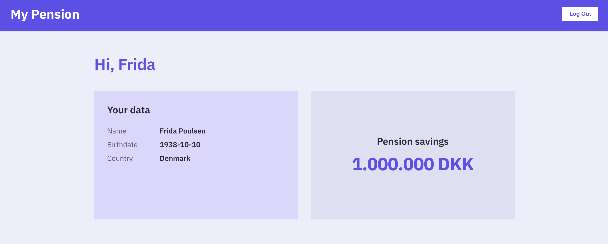

# Example app with @criipto/verify-react

A minimal app that logs users in with an eID and shows the [claims](https://docs.idura.app/verify/reference/glossary/#claims) from their [ID token](https://docs.idura.app/verify/reference/glossary/#id-token).



`CriiptoVerifyProvider` is implemented in [src/index.tsx](src/index.tsx) and the primary app logic is in [src/App.tsx](src/App.tsx).

## Running the app

```sh
npm install && npm start
```

The app is configured to run with the following example credentials:

```jsx
domain = 'samples.criipto.id';
clientID = 'urn:criipto:samples:criipto-verify-react';
```

If using the default credentials, the app should run on `localhost:3000`.

You can also run the app with your own [Idura application credentials](https://docs.idura.app/verify/getting-started/dashboard-setup/#register-an-application). To do so, update the `domain` and `clientID` values in [src/index.tsx](src/index.tsx) and make sure to add the host that the app runs on to the list of redirect URLs for your Idura application.
